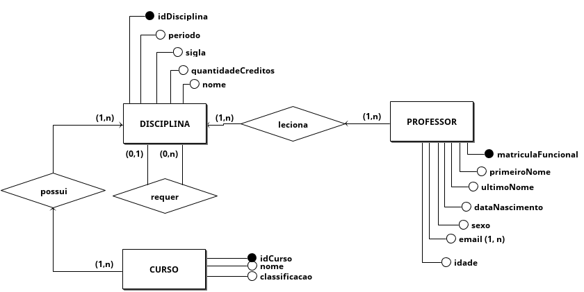
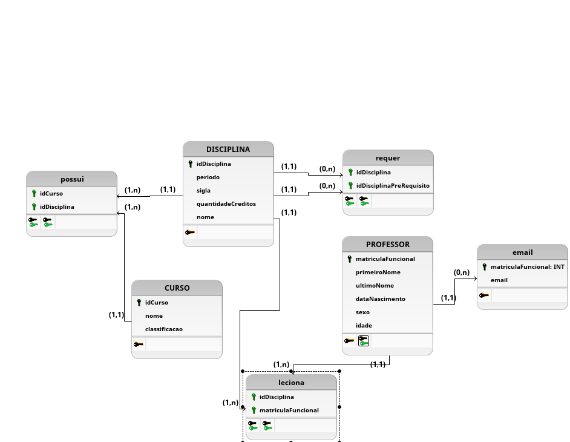

**Rafael Makaha Gomes Ferreira - 160142369 17/10/2019**

**MODELO DE ENTIDADE E RELACIONAMENTO (ME-R)**

`  `**ENTIDADES**

`	`PROFESSOR (matriculaFuncional,  primeiroNome, ultimoNome, dataNascimento, sexo, idade, {email})

`	`DISCIPLINA (idDisciplina, periodo,  sigla, quantidadeCreditos, nome)

**Notas:**

**1. ausência dos atributos primeiroNome,  último nome, dataNascimento, sexo, idade em Professor**

**2. ausencia dos atributos periodo, sigla, quantidadeCreditos em Disciplina**

**3. Não há necessidade de entidade CURSO**

**4. Foi mantida a matriculaFuncional como identificador do Professor**

**RELACIONAMENTOS:**
**
`	`PROFESSOR – **leciona** – DISCIPLINA
**
`	`Um professor pode lecionar em várias disciplinas e uma disciplina pode ser lecionada por vários professores.

`	`**Cardinalidade: n:m**

`	`DISCIPLINA – **requer** – DISCIPLINA
**
`	`Uma disciplina pode requerir zero  ou várias disciplinas como pré-requisito.

`	`**Cardinalidade: 1:n**

**Notas:**

**1. Não há entidade Aluno, portanto, seus relacionamentos não devem existir**

**2. O relacionamento do Professor deve ser voltado para ser apto ou não às suas disciplinas lecionáveis.**

**3. Não havia o auto-relacionamento entre as disciplinas. Adicionado.**

**Modelo Conceitual (DE-R)**

**Notas:**

**1. Seguem os mesmos erros encontrados no MER**

**Modelo Lógico**

**Notas:**

**1. Mesmos problemas encontrados no MER**

**2. Não definidos tamanhos de algumas variáveis como: int e BIGINT**
